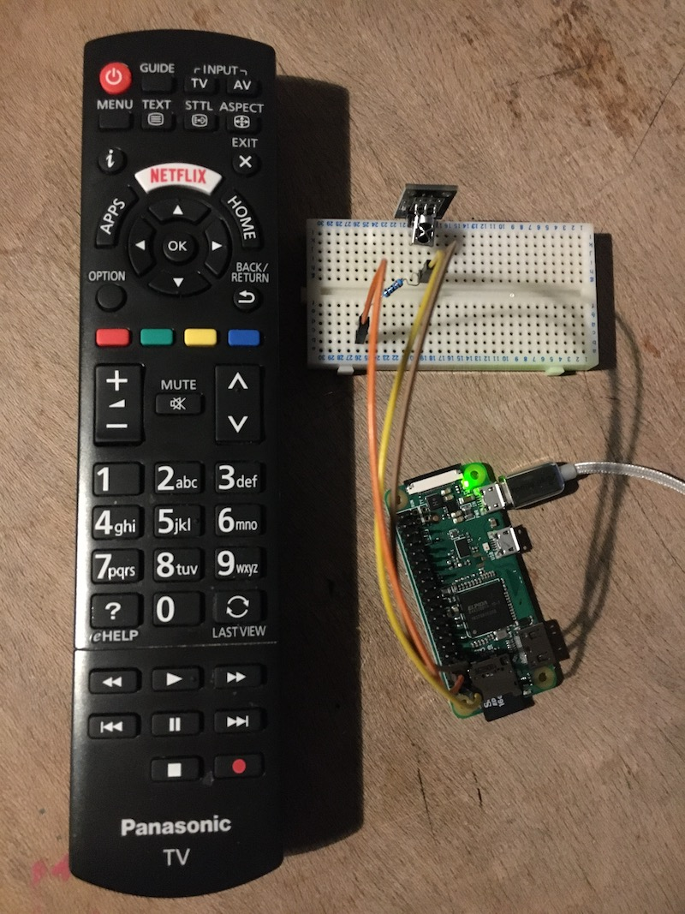

# Infrared

A Go library for reading Infrared signals on the Raspberry Pi.

Tested on the Raspberry Pi Zero with Go 1.13.

Currently only supports the Panasonic remote for my TV.



## Example

View `main.go` to see a demonstration of graceful shutdown.

```go
package main

import (
	"context"
	"fmt"
	"log"
	"sync"

	"github.com/a-h/infrared/decoder"
	"github.com/a-h/infrared/edge"
	"github.com/stianeikeland/go-rpio/v4"
)

func main() {
	err := rpio.Open()
	defer rpio.Close()
	if err != nil {
		log.Fatal("GPIO open error")
	}

	irIn := rpio.Pin(4)
	irIn.Input()

	// Create a channel to receive codes from the IR.
	// Use a buffered channel to avoid failing to handle IR if the processing code is slow to process the results.
	codes := make(chan uint64, 64)

	// Start a routine to receive IR codes.
	go func() {
		for code := range codes {
			// This program expects Panasonic codes so we can look up the names and print them.
			fmt.Println(code, decoder.PanasonicCodeToKey[code])
		}
	}()

	// Start decoding.
	ed := edge.NewDetector(irIn)
	ed.Decode(context.Background(), decoder.Panasonic, codes)
	close(codes)
}
```
